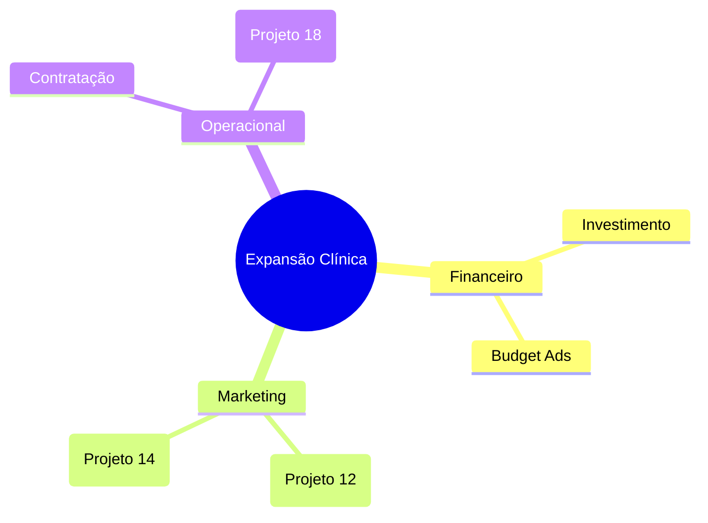

# 🧠 PROJETO 17: Meeting Intel & Mind Map Architect (V2.0)

> **Status:** Engenharia de Decisões (Baseado em Mermaid.js e Miro API)
> **Objetivo:** Acabar com o esquecimento pós-reunião. Converter conversas e reuniões em mapas mentais visuais, atas estruturadas e tarefas acionáveis instantaneamente.

---

## 🏗️ 1. O Conceito "Cérebro Estruturado"
O **Meeting Intel** atua como um tradutor de caos em ordem:
- **Atas Profissionais:** Extrai o "quem", "o quê" e "até quando".
- **Visualização:** Transforma a discussão em um mapa mental claro para ver as ramificações de uma ideia.
- **Colaboração:** Prepara o ambiente de trabalho (Miro) antes mesmo do gestor sentar na cadeira.

---

## 🛠️ 2. Workflow de Estruturação
1.  **Captura:** O gestor envia um áudio longo de uma reunião ou uma série de mensagens de brainstorming no WhatsApp.
2.  **Análise de Decisão (NLP):**
    - IA identifica **Decisões Tomadas** (Highlight em negrito).
    - IA lista **Action Items** (Tarefas com responsável e prazo).
3.  **Geração Visual (Mermaid.js):**
    - O bot escreve o código do mapa mental: `mindmap root((Reunião)) --> [Projeto X]`.
    - O sistema renderiza a imagem no painel de controle (Projeto 8).
4.  **Miro Integration:**
    - Bot cria um board: `/api/miro/create_board`.
    - Adiciona post-its coloridos para cada categoria (Ideia, Risco, Ação).

---

## 💻 3. Lógica de Prompt (Structured Summary)

```yaml
role: "Secretário Executivo de Alta Performance"
task: "Analise a conversa e gere um resumo executivo."
sections:
  - Resumo de 1 frase (Elevator Pitch).
  - Tabela de Decisões (O que foi batido o martelo).
  - Tabela de Pendências (Tarefa | Quem | Prazo).
  - MindMap_Code (Mermaid syntax).
```

---

## 📊 4. Mermaid Syntax Exemplo (Mind Map)
O bot gera o texto abaixo que vira um gráfico:



---

## 🚀 5. Diferencial IA
Integração com o **PROJETO 23 (OKR)**. Se durante a reunião for decidido algo que altera a meta do trimestre, o bot avisa: *"Gestor, notei que mudamos o foco para [X]. Deseja que eu atualize o OKR de faturação no painel agora?"*.
